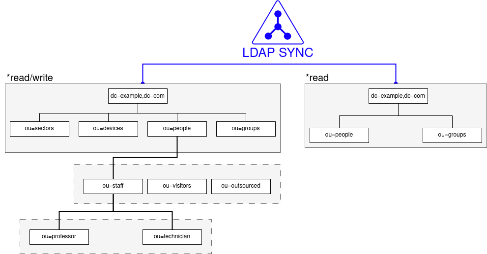

# php-ldap-esbart

A fork from esbart project which is an LDAP web frontend written in PHP. The goal is making the code more flexible so that it will be supported in more LDAP bases. In the future it will support working with radius attributes.

## Mods:

* Added support for docker;
* Defined new LDAP parameters:
  * LDAP_SEARCH_DN
  * LDAP_USER_ATTRS
  * LDAP_GROUP_ATTR
  * LDAP_GROUPS_DN
  * LDAP_USER_OBJ_CLASSES
  * LDAP_SYNC_TREE
  * LDAP_SYNC_SEARCH_DN
  * LDAP_SYNC_SEARCH_FILTER
  * LDAP_SYNC_USER
  * LDAP_SYNC_HOST
  * LDAP_SYNC_PASS
  * LDAP_SYNC_ATTR
  * LDAP_SYNC_USER_ATTRS
* Removed create/assisted mode;
* Added javascript autocomplete login input for create user based on typed user name's;
* Removed hidden input name;
* Added Organizational Unit for crease user page;
* Added synchronization database;

## For who:

This software is intended for those who need to synchronize data from a local LDAP base with a remote LDAP base accessible through a read-only user. Consequently, some attributes will always be read-only in the local base (synchronization data) while others are read-write and may not exist in the remote base. The picture below exemplifies two bases with different structure and access and fit the context of this software.

  

## Running:

git clone https://github.com/dcc6fvo/php-ldap-esbart.git

cd php-ldap-esbart

docker compose up

